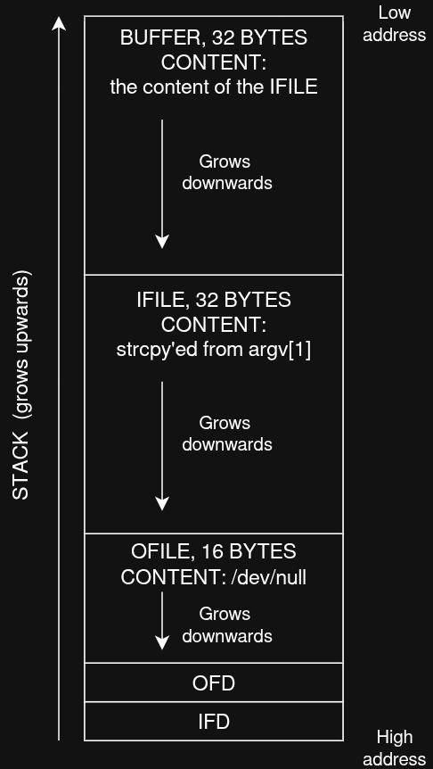

# narnia3

This was... easy? I mean, the logic behind the explot was straightforward, but there was a little bit of Linux knowledge behind it, to make the level worth. I found narnia3 to be cool because we've been playing all this time in an environment that was restricting us to execute certain files, reading some, creating directories only in `/tmp` folder, etc... and we've taken that from granted since it's a challenge for us.

But hey, the challenge is still hosted on a linux server and it is a perfetcly normal system which has its configuration and limitation... that makes sense! And we're gonna learn about some of them in this level!

## Run the bad boy
```
$ /narnia/narnia3
usage, /narnia/narnia3 file, will send contents of file 2 /dev/null
```
Uh! So we pass a filepath as a parameter, and it should copy it's content to `/dev/null` a.k.a. the Linux black hole. Funny! Let's look at the code.

## The Code
It is exactly like we imagined! And we're fresh from narnia2 so we also notice a pretty immediate vulnerability that we used in the previous level, the careless `strcpy()` populating a buffer of a specified size.

In this case we see that the `strcpy` is performed to move the content of our agument in a variable used for the path of the file to be read, while the path of the destination file, the black hole, is hard coded into the program... but I think we can change it ehehehe

Let's quickly draw the stack to understand how it is composed and how we could overwrite the destination file path to something we want by, again, overflowing the buffer.



Stack is populated from the higher address going towards the lower address, so it grow upwards (terms may be confusing here, depends on how look at the addresses, let's not make confusion!). So in the first positions we find the two integers used to store the file descriptors that the `open()` syscall will return after opening the files.

Then we find our char arrays, in the order in which they appear in the code: first the `ofile` with its content already in memory, then `ifile` which is the destination of our `strcpy`, and then `buf` that the program is using as a middle ground to copy the content between files. Now: the buffers are written DOWNWARD, meaning that if we write stuff in `ifile` and we don't control ourselves (eheheh, gonna happen) we will write over the `ofile` memory. Sweet!

## Strategy
It is clear by know: we want the program to read the file containing the narnia4 password and copy its content into some file that we can read after. If we try to pass the narnia4 password file as a parameter, it is copied into `/dev/null`! But remember, we still need to perform a buffer overflow attack!

This is I think the trickiest part, but by executing the binary a couple of times you'll get the idea immediately: if we try with something like `/etc/narnia_pass/narnia4AAAAAAAA/tmp/n3/pwd` (48 bytes long) and we actually create the `/tmp/n3/pwd` file in the system (that in the string starts after exactly 32 bytes, so that it will fill the `ofile` buffer) you'll see that the program does not say anything bad when opening the `ofile` (which is now `/tmp/n3/pwd`, if you don't believe me you should be able to look at it with gdb/gef now :)) but it is annoyed by the fact that the path of the input file is no good, and the path is `/etc/narnia_pass/narnia4AAAAAAAA/tmp/n3/pwd`.

You get it? The **entire** path is considered as the `ifile`, while just the remaining bytes (max 16) after the 32s of the "real" `ifile` are considered as `ofile`, since we overflowed. So we should find a way to:
- have an `ofile` which is accessible to us, and starts at the 33th byte of the string passed as argument (and we have it, our `/tmp/n3/pwd` file)
- have the entire argument as a valid path, that not only points to our file of interest (the narnia4 password file) **BUT ALSO** has the `ofile` path inside **while still remaining valid when considered entirely**

In this case you may agree that we cannot have "filler bytes/chars" composing our string, but it has to be a real one. I like to start with how should look what we want to achieve, something like:
```
$ /narnia/narnia3 /tmp/PIPPOBAUDOPIPPOBAUDOPIPPOBA/tmp/n3/pwd
```
Look how beatiful it is, and it matches most of our criteria:
- `/tmp/PIPPOBAUDOPIPPOBAUDOPIPPOBA` is the right length to pupulate `ifile` (and we can create it, since contained in `/tmp`)
- `/tmp/n3/pwd` is now in `ofile` and targets our file, created for the occasion
- oh shit, but `/tmp/PIPPOBAUDOPIPPOBAUDOPIPPOBA/tmp/n3/pwd` (even though we can (and should) creat it, since again we can do anything we want in `/tmp`, also creating subfolders called `/tmp`) does not point to `/etc/narnia_pass/narnia4`... OR DOES IT? :P

## Simlinks
In Linux we can make a file that is a pointer to another file, and it is called a simlink! We do this by executing this command:
```
ln -s /etc/narnia_pass/narnia4 /tmp/PIPPOBAUDOPIPPOBAUDOPIPPOBA/tmp/n3/pwd
```
We are creating a simlink that points to our target file, narnia4, in the **entire** path that we'll be passing as a parameter. And yes, all the privileges are preserved! (not the ones of the simlink, by default a simlink will always have 777 on itself, but the pointed file is still accessible only according to its privileges design). Look [here](https://www.starlab.io/blog/linux-symbolic-links-convenient-useful-and-a-whole-lot-of-trouble) if you want to know more about them!

And know we have it all! Just run the challenge again with the same path as our last try and we can then cat our `/tmp/n3/pwd` file and save the password for the narnia4 challenge!

Skibidi!

## Something we should know
At the beginning I said that this was the challenge that made me realize how the whole server is setup... here's what I mean.
Do you notice that we do not have direct access to the password file of the next level via the command line, but when we find a way to exploit the binaries, they can access that resource?
Let's look at the privilegies of the narnia3 program
```
$ ll /narnia/narnia3
-r-sr-x--- 1 narnia4 narnia3 11520 Jul 28 19:05 /narnia/narnia3*
```
We see that:
- the owner of the file is `narnia4`... ok interesting
- the group of the file is `narnia3`, omg that's us
- by looking at the privilegies, we see that the owner has the `r-s` privs (**alredy confusing**) and the group has the `r-x` privs.

Wtf is that `s` priv? I discovered what it means, [here](https://www.redhat.com/en/blog/suid-sgid-sticky-bit).
Basically, if in the owner's privs there is the `s` in place of the `x`, it means that when launched, **also by other users**, the program will run with owners privs. And in fact, the narnia3 program can read the narnia4 password, since it is the owner, when run.

// comment on why shellcodes needed the setsuid()
